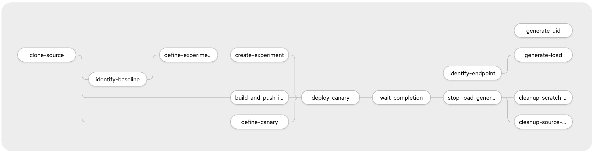

# Tekton Pipeline for Canary Rollout with iter8

This project documents a sample Tekton `Pipeline` that builds and canary rollout of new versions of an application using **iter8**
This is a superset of what is described in [blog]().

This assumes a basic understanding of [iter8](https://iter8.tools) and [Tekton](https://github.com/tektoncd/pipeline/tree/master/docs).

## Prerequisite Steps

### Required Software

- Istio: <https://istio.io/docs/setup/>

      istioctl manifest apply --set profile=demo

- iter8: <https://github.com/iter8-tools/docs/blob/master/doc_files/iter8_install.md>

      kubectl apply \
      -f https://raw.githubusercontent.com/iter8-tools/iter8-analytics/master/install/kubernetes/iter8-analytics.yaml \
      -f https://raw.githubusercontent.com/iter8-tools/iter8-controller/master/install/iter8-controller.yaml

- Tekton: <https://github.com/tektoncd/pipeline/blob/master/docs/install.md>

      kubectl apply --filename https://storage.googleapis.com/tekton-releases/pipeline/latest/release.yaml

If using webhooks, the following additional items are needed:

- Tekton Dashboard: <https://github.com/tektoncd/dashboard>
  
  Identify a release from the [list of releases](<https://github.com/tektoncd/dashboard/releases>) and install. For example, to install version 0.5.2:

      export TEKTON_DASHBOARD_VERSION=0.5.2
      kubectl apply \
      --filename https://github.com/tektoncd/dashboard/releases/download/v${TEKTON_DASHBOARD_VERSION}/tekton-dashboard-release.yaml \

### Assumptions

For simplicity we describe execution in a minikube cluster and assume that the pipeline is defined in the `default` namespace and will be executed using the `default` service account:

```bash
export PIPELINE_NAMESPACE=default
export SERVICE_ACCOUNT=default
```

We will demonstrate a canary rollout using the [bookinfo](https://istio.io/docs/examples/bookinfo/) application, an application used to demonstrate features of Istio.
It is comprised of 4 microservices and will be deployed to the `bookinfo-iter8` namespace:

```bash
export APPLICATION_NAMESPACE=bookinfo-iter8
```

### Set up **bookinfo** Application

The application be deployed using the instructions provided by the [iter8 tutorial](https://iter8.tools/tutorials/canary/#deploy-the-bookinfo-application). Alternatively, a Tekton task to  provide a Tekton `Task` to deploy the application:

```bash
kubectl --namespace ${PIPELINE_NAMESPACE} apply \
    --filename <rbac rules> \
    --filename <tekton task>
tkn task start \
   --param NAMESPACE=${APPLICATION_NAMESPACE} \
   --serivceaccount ${SERVICE_ACCOUNT}
```

### Fork Sample Application Code

The [bookinfo](https://istio.io/docs/examples/bookinfo/) application is composed of four microservices.
We will demonstrate it using the *reviews* microservice.
The sample pipeline builds code from a GitHub repository and deploys it using a canary rollout.
If it satisfies the canary criteria, the new build will be promoted.
To modify and build new versions, fork the sample project: <https://github.com/iter8-tools/bookinfoapp-reviews>.

### Define Secrets for Authentication

The build task reads the source code from a GitHub repository, builds a Docker image and pushes it to a Docker registry. At execution time, the pods need permission to read the GitHub repository and write to Docker registry. This can be accomplished by defining secrets and associating them with the service account that is used to run the pipeline.

We used a public repository on <https://github.com> so that GitHub secret is needed. A secret access to [DockerHub](https://hub.docker.com) can be defined from your local Docker configuration file:

```bash
kubectl create secret generic dockerhub  \
  --from-file=.dockerconfigjson=${DOCKER_CONFIG_FILE}  \
  --type=kubernetes.io/dockerconfigjson
```

By default, the Docker configuration is in ~/.docker/config.json. However, if this is just a reference to a credential store (for example, on a Mac), you will need extract the details. For example, by the method described [here](https://github.com/docker/for-mac/issues/4100#issuecomment-648491451).

For alternatives and additional details about authentication, see the [Tekton Documentation](https://github.com/tektoncd/pipeline/blob/master/docs/auth.md).

When executing a Tekton pipeline, each task can executed using a different service account. In the subsequent discussion we will asssume the service account is the default service account, `default` for all tasks.

The service account needs to be aware of the secret(s) providing access to GitHub and DockerHub:

```bash
kubectl patch --namespace ${PIPELINE_NAMESPACE} \
  serviceaccount ${SERVICE_ACCOUNT} \
  --patch '{"secrets": [{"name": "dockerhub"}]}'
```

### Authorize the Pipeline

Futhermore, the tasks need access to a number of cloud resources. The pipeline tasks create iter8 experiments, reads Istio virtual system and destination rules and create kubernetes services and deployments. The service account that runs these tasks must have permission to take these actions.

A `ClusterRole` and `ClusterRoleBinding` can be used to define the necessary permissions and to assign it to service account:

```yaml
kubectl apply --filename - <<EOF
apiVersion: rbac.authorization.k8s.io/v1
kind: ClusterRole
metadata:
  name: tekton-iter8-role
rules:
- apiGroups: [""]
  resources: [ "services", "nodes" ]
  verbs: [ "get", "list" ]
- apiGroups: [ "apps" ]
  resources: [ "deployments" ]
  verbs: [ "get", "list", "watch", "create", "update", "patch", "delete" ]
- apiGroups: [ "iter8.tools" ]
  resources: [ "experiments" ]
  verbs: [ "get", "list", "watch", "create", "update", "patch", "delete" ]
- apiGroups: [ "networking.istio.io" ]
  resources: [ "destinationrules", "virtualservices" ]
  verbs: [ "get", "list" ]
---
apiVersion: rbac.authorization.k8s.io/v1
kind: ClusterRoleBinding
metadata:
  name: tekton-iter8-binding-${PIPELINE_NAMESPACE}
roleRef:
  apiGroup: rbac.authorization.k8s.io
  kind: ClusterRole
  name: tekton-iter8-role
subjects:
- kind: ServiceAccount
  name: ${SERVICE_ACCOUNT}
  namespace: ${PIPELINE_NAMESPACE}
EOF
```

### Define Workspaces

The sample pipeline uses two *workspaces*, *experiment_storage* and *source_storage*, to share files between tasks. Thes are backed by persistent volumes.
On minikube, these can be defined as follows:

```bash
kubectl --namespace ${PIPELINE_NAMESPACE} \
    apply --filename https://raw.githubusercontent.com/kalantar/iter8-tekton/master/volumes.yaml
```

## Define the Pipeline

The pipeline we've defined can be visualized as:



It can be defined as follows:

```bash
kubectl --namespace ${PIPELINE_NAMESPACE} apply \
    --filename https://raw.githubusercontent.com/kalantar/iter8-tekton/master/tasks.yaml \
    --filename https://raw.githubusercontent.com/kalantar/iter8-tekton/master/canary-pipeline.yaml
```

Briefly, the behavior of each task is:

- **clone-source** -- clones the GitHub repository with the application to build and deploy
- **identify-baseline** -- identify the baseline version using heuristic rules
- **define-experiment** -- define iter8 experiment from template in the source repository
- **create-experiment** -- apply the experiment defined by **define-experiment**
- **build-and-push** -- build microservice from source
- **define-canary** -- define the deployment yaml for the new version using kustomize template in the source repository
- **deploy-canary** -- deploy the canary version
- **wait-completion** --  wait for the experiment to complete

Tasks related to load generation for demonstration purposes:

- **identify-endpoint** -- identify the application endpoint
- **generate-load** -- generate load
- **stop-load-generation** -- terminate the load generation

Tasks related to cleanup:

- **generate-uid** -- generate a unique UUID by which to link tasks together
- **cleanup-scratch-workspace** -- delete any intermediate files
- **cleanup-source-workspace** -- delete source code and any intermediate files

## Running the Pipeline

Finally, to execute the pipeline, we must create a `PipelineRun` resource. The `PipelineRun` resource sets any run specific parameters.

A `PipelineRun` can be created manually as follows:

```bash
kubectl apply --filename - <<EOF
apiVersion: tekton.dev/v1beta1
kind: PipelineRun
metadata:
  name: canary-rollout
spec:
  pipelineRef:
    name: canary-rollout-iter8
  workspaces:
  - name: source
    persistentVolumeClaim:
      claimName: source-storage
  - name: experiment-dir
    persistentVolumeClaim:
      claimName: experiment-storage
  params:
  - name: application-source
    value: https://github.com/kalantar/reviews
  - name: application-namespace
    value: ${APPLICATION_NAMESPACE}
  - name: application-image
    value: kalantar/reviews
  - name: application-query
    value: productpage

  - name: HOST
    value: "bookinfo.example.com"

  - name: experiment-template
    value: iter8/experiment.yaml
EOF
```

### Monitoring Pipeline Execution

We can follow the execution of the pipeline:

    watch tkn taskrun list --namespace ${PIPELINE_NAMESPACE}

We can follow the execution of iter8 by observing the creation and progress of the experiment:

    watch kubectl --namespace ${APPLICATION_NAMESPACE} experiments.iter8.tools


### Triggering via Github Webhooks

Tekton triggers can be used in configure a response to github webhooks.  The Tekton dashboard provides some helpers for configuration.

#### Install Tekton Triggers

To install a particular version of [Tekton triggers](https://github.com/tektoncd/triggers), for example, version 0.2.1:

    export IPADDRESS=<dummy_ip_address>
    export TEKTON_TRIGGERS_VERSION=0.2.1
    curl -L https://github.com/tektoncd/dashboard/releases/download/v${TEKTON_TRIGGERS_VERSION}/tekton-webhooks-extension-release.yaml \
    | sed -e "s#IPADDRESS#$ip#g" \
    | kubectl apply -f -

For more information see: <https://github.com/tektoncd/triggers/blob/master/docs/install.md>

#### Install Tekton Dashboard Webhooks Extension

To install the [webhooks extension](https://github.com/tektoncd/experimental/tree/master/webhooks-extension):

    kubectl apply --filename https://github.com/tektoncd/dashboard/releases/download/v${TEKTON_DASHBOARD_VERSION}/tekton-webhooks-extension-release.yaml

#### Define `TriggerTemplate` and `TriggerBinding`

When a github webhook is called, an event listener will use a `TriggerTemplate` to create the necessary `PipelineResource` and `PipelineRun` objects that will mange the execution of the pipeline. The `TriggerBinding` provides the necessary mapping from the github webhook payload to the template.

The full definitions are [here](https://github.com/kalantar/iter8-tekton/blob/master/triggers.yaml). It can be created as in the Tekton install namespace:

    kubectl --namespace tekton-pipelines apply --filename https://raw.githubusercontent.com/kalantar/iter8-tekton/master/triggers.yaml

#### Create the Webhook

In the Tekton Dashboard, navigate to the webhooks and select `Add Webhook`. Fill in the required fields and click `Create`. For details on the requirements, see the [getting started guide](https://github.com/tektoncd/experimental/blob/master/webhooks-extension/docs/GettingStarted.md). At present, this may require some fixes after the fact. For:

- [Amazon EKS](https://github.com/tektoncd/experimental/blob/master/webhooks-extension/docs/GettingStarted.md#notes-for-amazon-eks)

- IBM Kubernetes Service (IKS):

  - Identify the external IP address of the ingress that is created:

        kubectl --namespace tekton-pipelines get ingress el-tekton-webhooks-eventlistener -o jsonpath='{.status.loadBalancer.ingress[0].ip}'

  - Modify the deployment `webhooks-extension` to update  environment variable `WEBHOOK_CALLBACK_URL` with the IP address:

        kubectl --namespace tekton-pipelines edit deployment webhooks-extension

  - Edit the ingress `el-tekton-webhooks-eventlistener` to change the `host` to match the IP address:

        kubectl --namespace tekton-pipelines edit ingress el-tekton-webhooks-eventlistener

  - Terminate the ingress pod (it must be manually restarted to pick up the changes)

        kubectl --namespace tekton-pipelines get pods --selector=eventlistener=tekton-webhooks-eventlistener --no-headers -o name | xargs -I {} kubectl --namespace tekton-pipelines delete {}

  - Modify the webhook address github

#### Testing the Webhook

Once the webhook is defined, it can be triggered by pushing a change to the github repo.

Modify line 41 of `reviews-application/src/main/java/application/rest/LibertyRestEndpoint.java` by chaging the value of `star_color`.

Pushing this change will automatically create a new `PipelineRun` object which will cause the pipeline to execute.
